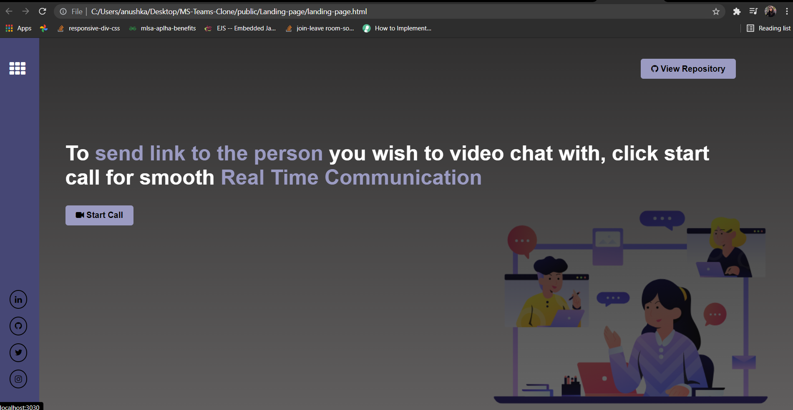
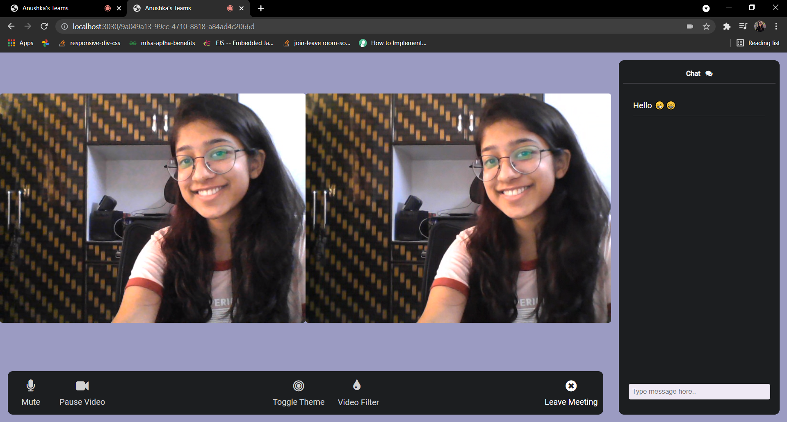
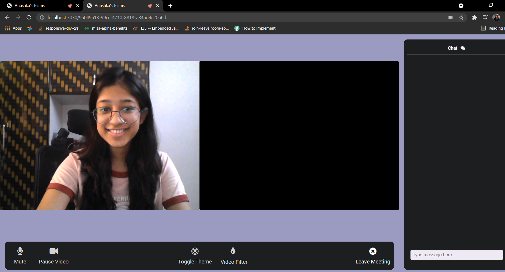
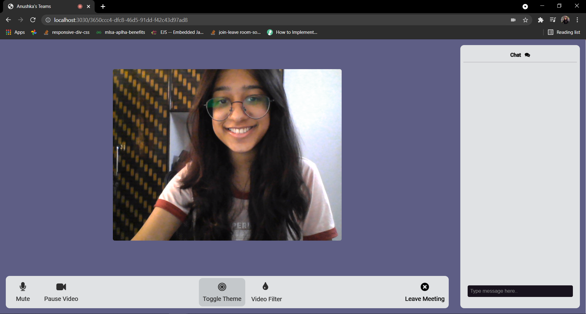
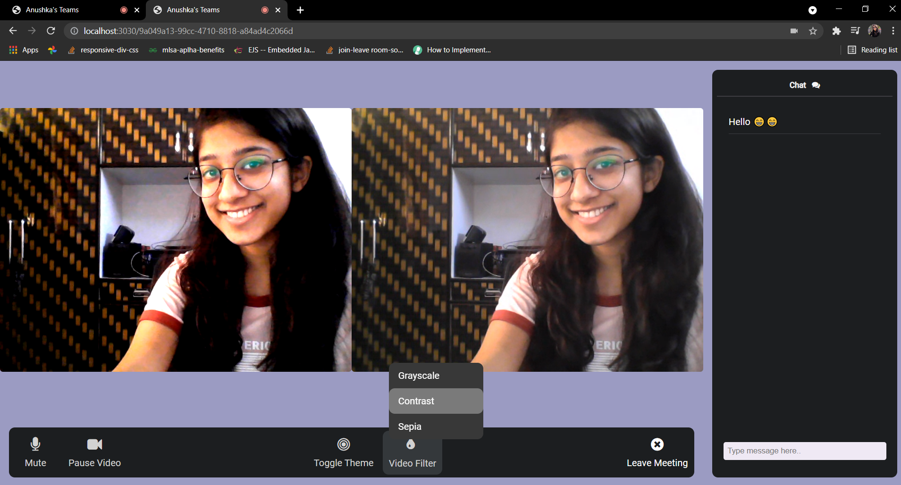
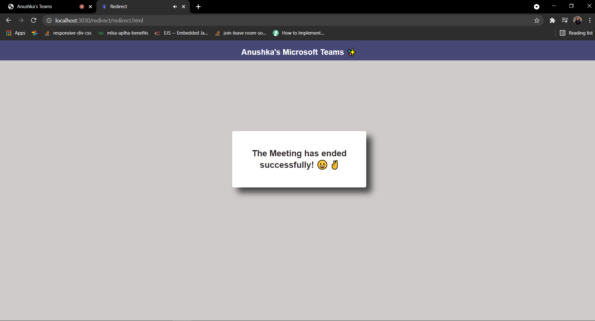

## Anushka's MS Teams Clone 💻💬👋

* A fully functional web application that allows Real Time Communication for **multiple** users.
* Demonstration of the Web App : https://youtu.be/GyrC10PrsUY
* Link to the Design Doc : [Design Document](https://drive.google.com/drive/folders/1PV3ezBto45ivA5F6G6wzHCYvrxV8pf7I?usp=sharing)

### The Challenge 💡

#### Build a Microsoft Teams clone
Your solution should be a fully functional prototype with at least one mandatory functionality - a minimum of two participants should be able connect with each other using your product to have a video conversation.

### Features Accomplished 🤩
* Generate unique URL (Landing Page)
* Mute/Unmute Audio
* Pause/Resume Video
* Live Chat
* Toggle Theme
* Video Filters- 
    * Grayscale
    * Contrast
    * Sepia
* Leave Meeting

### Technology Decisions 👩🏻‍💻
* **IDE** : Visual Studio Code
* **Platform** : WebRTC
* **Libraries** :
	 * UUID
	 * PeerJS
	 * Socket.io
* **Framework** : Express
* **Runtime Environment** : Node.js
* **Version Control System :** GitHub
* **Languages** :
	* HTML
	* CSS
	* JavaScript
	* EJS
### Agile Methodology 🏃
** Agile** is a chain of development in which specific set of tasks are performed iteration wise according to the priority. I divided the web App into smaller chunks and worked on each of them separately. When each feature was successfully added and tested, I created a new branch, then generated a PR and merged it in my main branch if no conflicts were found. Agile methodology taught me how to work flawlessly and in an organized manner.

### Download Files 👇
* Go to my GitHub repository: https://github.com/anushkajain6459/MS-Teams-Clone
* Download Zip or clone repository
* Then open the folder in your IDE 

### Install the Dependencies ✌️

```shell
# run yarn install or npm install
npm install
npm install -g nodemon
```

### Run the App 😻

```shell
# to start the Web App, type
nodemon server.js
```
Runs the app in the development mode.

Open [http://localhost:3030](http://localhost:3030) to view the functioning in the browser 🎉

OR

To Start a new meeting, Open the **landing-page.html** in the browser and click on **Start Call** 🎉

Path :  Public → Landing-page → [landing-page.html ](https://github.com/anushkajain6459/MS-Teams-Clone/blob/main/public/Landing-page/landing-page.html)

### Glimpses 📷
 **Landing Page** ✨  

 **Video Call and text chat** 🎥   

 **Video & Audio On/Off** 🔇   

 **Toggle Theme** 🔘   

 **Video Filters** 🎨   

 **End Call** ❌   


